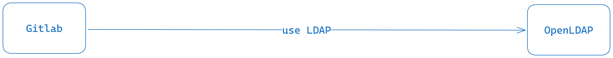

# LDAP SSO

## Description

This repository provides pre-configured Docker Compose files to set up GitLab and OpenLDAP in a way that allows GitLab to fetch users stored in OpenLDAP. It offers two different configurations: one that uses Keycloak as an intermediary between GitLab and OpenLDAP, and another that establishes a direct connection between GitLab and OpenLDAP. Everything is set up to be launched with a single command.

### Direct Connection



### Keycloak Intermediary


## Quick Start

### Without Keycloak

To launch the services without Keycloak, run the following command:

```bash
$ docker compose -f dc-no-keycloak.yaml up -d
```

### With Keycloak

To launch the services with Keycloak as an intermediary, run the following command:

```bash
$ docker compose -f dc-with-keycloak.yaml up -d
```

## Features

- **Direct Connection**: Provides a Docker Compose configuration for a direct connection between GitLab and OpenLDAP.
- **Keycloak Intermediary**: Provides an alternative Docker Compose configuration that uses Keycloak as an intermediary between GitLab and OpenLDAP.
- **Pre-configured**: No additional setup required. Just run the Docker Compose command to get everything up and running.

## Requirements

- Docker
- Docker Compose

## Configuration

Both Docker Compose files are pre-configured, so no additional setup is required. However, you can customize the configurations as per your requirements.

## Contributing

Feel free to submit issues and enhancement requests.

## License

MIT License. See [LICENSE](LICENSE) for more information.
